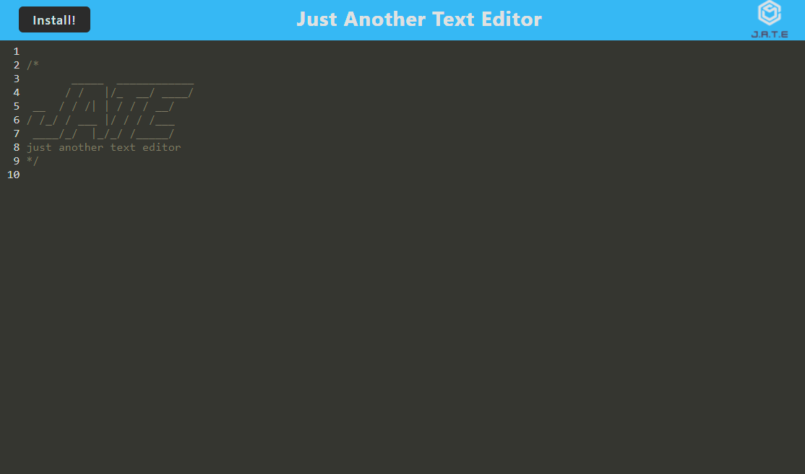

# JN-PWA-Text-Editor

## Table of Contents

- [Description](#description)
- [Installation](#installation)
- [Usage](#usage)
- [Credits](#credits)
- [Links](#links)

## Description

Through this challenge, I was able to build a text editor that runs in the browser. The app is a single-page application that meets the progressive web application criteria. While it works well in the browser, the application can also be downloaded by clicking the ```Install``` button! The web page was built following the acceptance criterias listed below:

```md
GIVEN a text editor web application
WHEN I open my application in my editor
THEN I should see a client server folder structure
WHEN I run `npm run start` from the root directory
THEN I find that my application should start up the backend and serve the client
WHEN I run the text editor application from my terminal
THEN I find that my JavaScript files have been bundled using webpack
WHEN I run my webpack plugins
THEN I find that I have a generated HTML file, service worker, and a manifest file
WHEN I use next-gen JavaScript in my application
THEN I find that the text editor still functions in the browser without errors
WHEN I open the text editor
THEN I find that IndexedDB has immediately created a database storage
WHEN I enter content and subsequently click off of the DOM window
THEN I find that the content in the text editor has been saved with IndexedDB
WHEN I reopen the text editor after closing it
THEN I find that the content in the text editor has been retrieved from our IndexedDB
WHEN I click on the Install button
THEN I download my web application as an icon on my desktop
WHEN I load my web application
THEN I should have a registered service worker using workbox
WHEN I register a service worker
THEN I should have my static assets pre cached upon loading along with subsequent pages and static assets
WHEN I deploy to Render
THEN I should have proper build scripts for a webpack application
```

The project was created with starter code that was provided. Render was used in order to deploy the application. You can visit the deployed page by clicking [here](https://jn-pwa-text-editor.onrender.com/)!

## Installation

In order to navigate through the text editor code, you will need to:

- Install the dependencies in the package.json files by running `npm i` in the integrated terminal <br>
- Run the files by typing `npm run start` in root directory of the integrated terminal <br>

## Usage

You can navigate to the [deployed page](https://jn-pwa-text-editor.onrender.com/) in order to test the text editor. By typing into the text editor, you will see that the data persists due to IndexedDB, even when you refresh the page! You can also install the application by clicking the `Install!` button seen in the top left corner!

You can see how the deployed app appears below:



## Credits

Thank you, Chris B. & Andrew B., for all your help! 😊👍

## Links

[GitHub Repository](https://github.com/jkimys2/JN-PWA-Text-Editor) <br>
[Deployed Page](https://jn-pwa-text-editor.onrender.com/)
